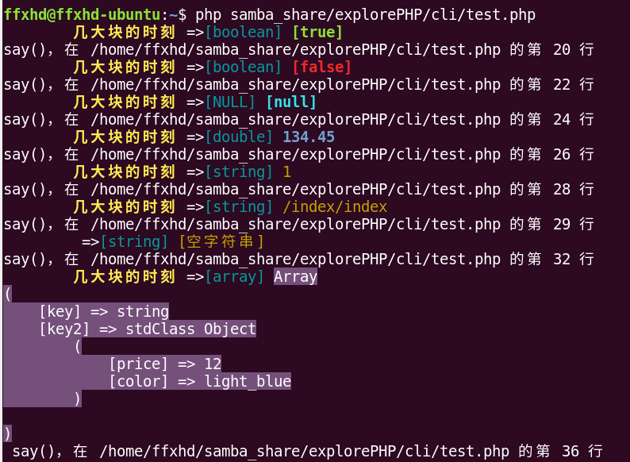

support : 
* only use swoole http server;
* nginx + swoole http server; 
* nginx + (php-fpm), no swoole. 
* Part of the output of CLI in Linux is colorful.

# debug

strongly recommend:

<blockquote>
<pre>
require '/home/ffxhd/samba_share/explorePHP/function/function_debug.php';
say($variable);
say('variableMean',$variable,
'variableMean2',$variable2,
'variableMean3',$variable3);
</pre>
</blockquote>

say()'s parameter's length is unlimited which is like javaScript's console.log();
say() wil tell you that where you call say()。

if run in linu Terminal,output is colorful。

if you need nginx, add some config
----------
* All static file are in /onRequest/public.When you visit html files, to avoid always input "/onRequest/public" 
in order to save time and energy, add some config for nginx,like this:
<blockquote>
<pre>
location ~ \.(html)$ {
     root  /home/ffxhd/samba_share/explorePHP/onRequest/public; #your absolute path
}
</pre>
</blockquote>
now "http://nginx.swoole.local/websocket.html" is same to "http://nginx.swoole.local/onRequest/public/websocket.html"

* if no swoole 
<blockquote>
<pre>
location /{
	if (!-e $request_filename) {
	   rewrite  ^(.*)$  /index.php$1  last;
	   break;
	}
}
</pre>
</blockquote>
now "http://test.php.local/index/test" is same to "http://test.php.local/index.php/index/test"
 
# Attention:
php 7 